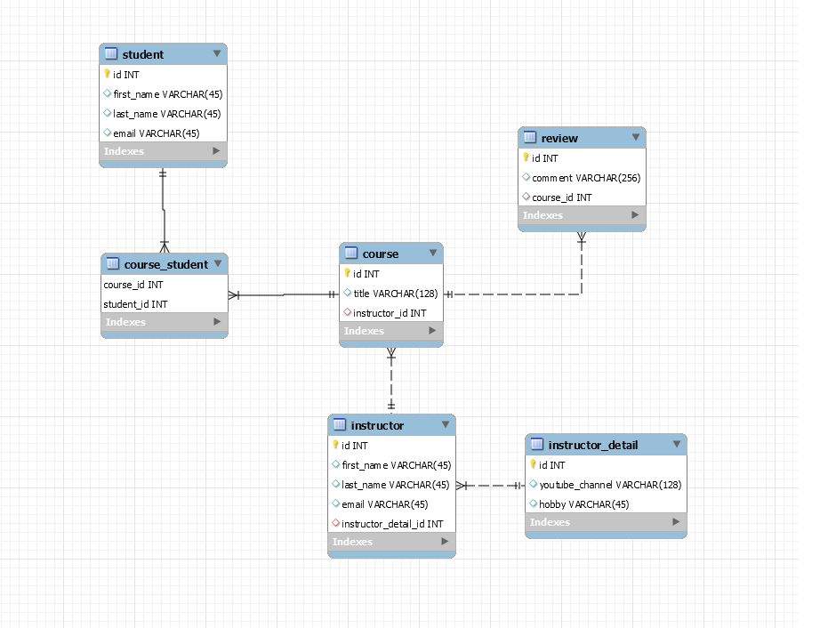
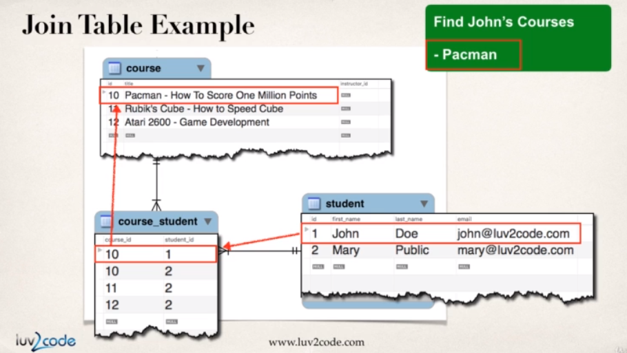

<h1 align="center">
    Hibernate 🥫 
</h1>

    Hibernate ORM (Object-Relational Mapping) is an object-relational mapping tool for the Java programming language. It provides a framework for mapping an object-oriented domain model to a relational database.

## Example ERD
Following ERD is used in the given example.

## Hibernate Annotations

`NOTE`
* The Persistence tab in IntelliJ will show the database tables/entities that we created using hibernate/persistence.
* Make sure to import all the annotations from `javax.persistence`.

Annotations | Description
---| ---| 
`@Entity` | Marks the class as an entity.
`@Table(name="table-name")` | Maps the entity to table.
`@Id` | Marks the field as an ID-Column of the table.
`@Column` | Shows that the field is the column of the database.
`@GeneratedValue(strategy = GenerationType.IDENTITY)` | Shows that the table is incrementing the PK itself in the DB.
`@JoinColumn(name = "FK_id")` | Add FK in parent table.
`@OneToOne(mappedBy = "childInstance", cascade = CascadeType.ALL)` | Make relationship bidirectional by using this in child table. mappedBy tells the Instructor class that look for 'instructorDetail' property.
`@OneToMany` OR `@ManyToOne` | To enable OneToMany relationship 
`@ManyToMany` | To enable ManyToMany relationship 

## Types of Mappings
Mainly, 4 types of relationships can be established b/w tables in an ERD.

Mapping Type | Description
---| ---|
OneToOne | Eg: Instructor --> Instructor detail
OneToMany | Eg: Instructor --> Courses (This can be many to many, but just assume)
ManyToMany | Eg: Student --> Course
ManyToOne | Same as OneToMany, but used from the child to enable bidirectional relationship.

## Types of Directions
2 Directions: 

Direction | Description
---| ---|
Uni-Directional | Just load the parent table (table with FK), and load the instances of child table from it.
Bi-Directional | Can load both tables, and can get the instance of eachother from both the tables.

## Coding Concepts / Snippets

[comment]: <> (Setup Mysql)

Setup MySql

* Install MySQL.
* Open CMD in the `C:\Program Files\MySQL\MySQL Server 8.0\bin` path, and enter the following command:

      mysql -u root -p

* It will ask for a password, enter the password and now we have access to MySQL.
* Now create a user to access the database using the following command.

      CREATE USER 'dbadmin'@'localhost' IDENTIFIED BY 'password';

* Once the user is created, you can check if the user exists by using the following command:

      SELECT user FROM mysql.user;

* Now create a database using the following query:

      CREATE DATABASE testdb;

* Create a table using the following query. Make sure to select the database using `use databaseName` command to select the database for table creation.

      CREATE TABLE Employee (
        firstName VARCHAR(30) NOT NULL, 
        lastName VARCHAR(30) NOT NULL, 
        employeeId INT UNSIGNED NOT NULL PRIMARY KEY
      );

  The `show tables` command will show all tables in the database, and `describe tablename` command will show details of the table.

* Now we have to give privileges to the user that we just created in order to access the database. use the query below to assign privileges.

       GRANT ALL PRIVILEGES ON testdb.employee TO 'dbadmin'@'localhost' WITH GRANT OPTION;

* To check the privileges of a user, use the following query:

      SHOW GRANTS FOR 'dbadmin'@'localhost';

* Set auto increment in MySQL and just pass the values of all columns except PK, it will automatically increment PK.
  
      ALTER TABLE student MODIFY id int NOT NULL AUTO_INCREMENT;

* To check index(Constraints details) of a table, use the following command:

      SELECT INDEX FROM table_name;

* Run the following command to execute a file script:

      SOURCE c:/users/khannosa/Desktop/spring-hibernate/assets/hb-01-one-to-one-uni/create-db.sql

[comment]: <> (Testing Database Connection)

Testing Database Connection

Following code is used to test the connection with the database.

    package com.osama.springhibernate;
    
    import org.springframework.boot.SpringApplication;
    import org.springframework.boot.autoconfigure.SpringBootApplication;
    import org.springframework.boot.autoconfigure.jdbc.DataSourceAutoConfiguration;
    
    import java.sql.Connection;
    import java.sql.DriverManager;
    
    @SpringBootApplication(exclude = {DataSourceAutoConfiguration.class})
    public class SpringHibernateApplication {
    
        public static void main(String[] args) {
            SpringApplication.run(SpringHibernateApplication.class, args);
    
            /*
            * Database: MySQL
            * Testing Database Connection
            */
            String userName = "dbadmin";
            String password = "admin";
            String jdbcUrl = "jdbc:mysql://localhost:3306/testdb";
            try {
                System.out.println("Connecting to database");
                Connection con = DriverManager.getConnection(jdbcUrl, userName, password);
                System.out.println("Connection Successful");
            } catch (Exception exception) {
                exception.printStackTrace();
            }
        }
    }

Make sure to add `@SpringBootApplication(exclude = {DataSourceAutoConfiguration.class})` in the annotation.

[comment]: <> (Session Factory)

Session Factory

* Session Factory Reads the Hibernate config file and creates the heavy-weight session objects. 
* `Session objects` develops connection with the database, and we use that object again and again.

[comment]: <> (Cascade Types)

Cascade Types

OneToOne Cascade Type | Description
---| ---|
PERSIST | if entity is persisted / saved, related entity will also be persisted. 
REMOVE | if entity is removed / deleted, related entity will also be deleted.
REFRESH | if entity is refreshed, related entity will also be refreshed.
DETACH | if entity is detached (not associated with session), related entity will also be detached.
MERGE | if entity is merged, then related entity will also be merged.
ALL | All of the above cascade types.

[comment]: <> (OneToOne)

OneToOne

* The Example covered here is an example of Instructor <--> InstructorDetail `Bi-Directional` and `Directional`.
* `Can apply cascades` Instructor and InstructorDetail can `Get` and `Delete` each other.

[comment]: <> (OneToMany)

OneToMany

* The Example covered here is an example of Instructor <--> Course `Bi-Directional`.
* The Example covered here is an example of Course <--> Reviews `Uni-Directional`.
* `Donot apply delete cascades`: Instructor and courses are not dependent.

[comment]: <> (Delete)

Delete from one table and keep in other table, OneToOne

If we want to delete an `instructor_detail` and keep `instructor` than set

    @OneToOne(mappedBy = "instructorDetail",cascade = {CascadeType.DETACH, CascadeType.REFRESH, CascadeType.MERGE, CascadeType.PERSIST})
    private Instructor instructor;

Instead of:

    @OneToOne(mappedBy = "instructorDetail", cascade = CascadeType.ALL)
    private Instructor instructor;

CascadeType.DELETE, also in the DAO class before deleting, break the association by using:
    
    tempInstructor.getInstructorDetail().setInstructorDetail(null);

[comment]: <> (Many To Many)

ManyToMany

* `Join Table` A table that provides the mapping for the 2 tables. it has FK's of both the tables.
* `Do not apply cascades`, deleting student will not delete the course.
* The below image shows how man to many mappings work.

`Example`

* The below code shows the setup of ManyToMany mapping in Course class:
  
      @ManyToMany(fetch = FetchType.LAZY,
          cascade = {CascadeType.PERSIST, CascadeType.DETACH, CascadeType.MERGE, CascadeType.REFRESH})
      @JoinTable(
          name = "course-student",
          joinColumns = @JoinColumn(name = "course_id"),
          inverseJoinColumns = @JoinColumn(name = "student_id")
      )    
      private List<Student> students;

* The below code shows the setup of ManyToMany mapping in Student class:

      @ManyToMany(fetch = FetchType.LAZY,
            cascade = {CascadeType.PERSIST, CascadeType.DETACH, CascadeType.MERGE, CascadeType.REFRESH})
      @JoinTable(
            name = "course-student",
            joinColumns = @JoinColumn(name = "student_id"),
            inverseJoinColumns = @JoinColumn(name = "course_id")
      )
      private List<Course> courses;

[comment]: <> (Lazy Load vs Eager Load)

Lazy Loading vs Eager Loading

* Default fetch types for mapping are given below:

Mapping | Default Fetch Type
---| ---|
OneToOne | FetchType.EAGER
OneToMany | FetchType.LAZY
ManyToOne | FetchType.EAGER
ManyToMany | FetchType.LAZY

* `Note` You need to have an open session in order to Lazy Load the data.

* Two main ways of lazy loading the data:
  * `session.get` and call the appropriate getter method.
  * `HQL`, Hibernate Query language

        // Lazy Loading using HQL
        // Loading Everything we need when the session is opened!
        // Import from import org.hibernate.query.Query;
        Query<Instructor> query = session
                .createQuery("SELECT i FROM Instructor i JOIN FETCH i.courses where i.id=:instructorId", Instructor.class);

* If we have teacher and courses, `one-to-one` relation, and we load some data from the courses tables, 
and the fetch type is set to Eager loading, then it will also load the data from teacher table as well.

* The Following code shows the setting of the fetch type:

      @ManyToOne(fetch = FetchType.EAGER, cascade = {CascadeType.PERSIST, CascadeType.MERGE, CascadeType.REFRESH, CascadeType.DETACH})
      @JoinColumn(name = "instructor_id")
      private Instructor instructor;

The Following tables shows the differences b/w eager and lazy loading:

Lazy Loading | Eager Loading
---| ---|
Load the main entity first, and loads dependent entities on demand | Loads everything
Loads names of students | Loads all the student objects

[comment]: <> (Tips)

Tips

* The Many side of the Relationship has the FK and uses `@JoinColumn` annotation

